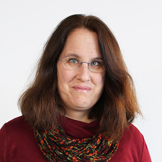
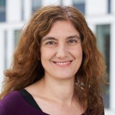
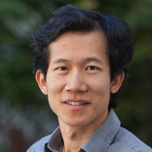
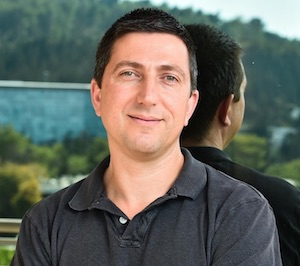
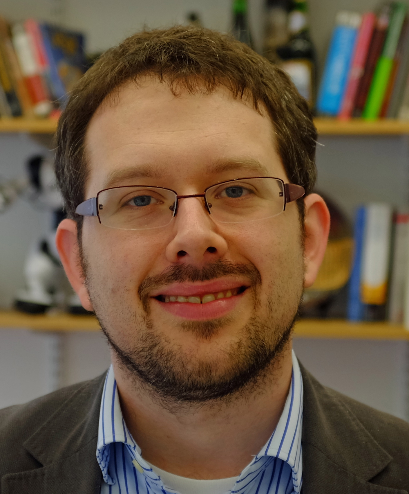
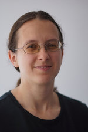
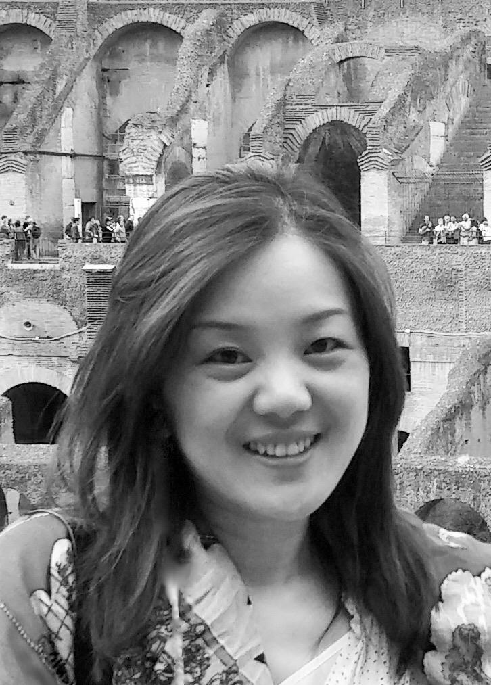
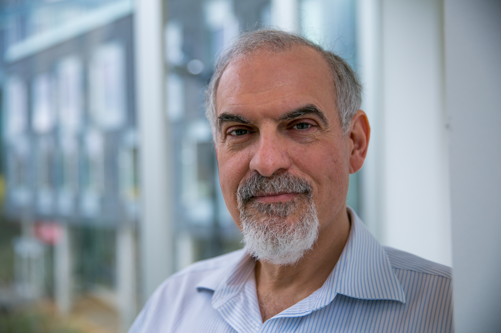

# Keynote Speakers
+ [Julia Hockenmaier](#julia_hockenmaier) (UIUC)
+ [Mirella Lapata](#mirella_lapata) (University of Edinburgh)
+ [Percy Liang](#percy_liang) (Stanford; Microsoft Semantic Machines)
+ [Eran Yahav](#eran_yahav) (Technion, Israel)
+ [Charles Sutton](#eran_yahav) (University of Edinburgh)
+ *[Stefanie Tellex](#stefanie_tellex) (Brown University)
+ *[Lin Tan](#lin_tan) (Purdue University)
+ *[Brad Myers](#brad_myers) (Carnegie Mellon University)

 

# Speaker Details

 [Julia Hockenmaier](http://juliahmr.cs.illinois.edu/) (UIUC)

**Talk**: _TBD_

**Bio**: TBD

 

 [Mirella Lapata](https://homepages.inf.ed.ac.uk/mlap/) (University of Edinburgh)

**Talk**: _TBD_

**Bio**: TBD

 

 [Percy Liang](https://cs.stanford.edu/~pliang/) (Stanford; Microsoft Semantic Machines)

**Talk**: _TBD_

**Bio**: TBD
 

 [Eran Yahav](http://www.cs.technion.ac.il/~yahave/) (Technion, Israel)

**Talk**: _TBD_

**Bio**: TBD

 

 [Charles Sutton](https://homepages.inf.ed.ac.uk/csutton/) (University of Edinburgh; Google AI)

**Talk**: _TBD_

**Bio**: TBD

 

 [Stefanie Tellex](https://cs.brown.edu/people/stellex/) (Brown University)

**Talk**: _TBD_

**Bio**: TBD

 

 [Lin Tan](https://www.cs.purdue.edu/homes/lintan/) (Purdue University)

**Talk**: _TBD_

**Bio**: TBD

 

 [Brad Myers](https://www.cs.cmu.edu/~bam/) (Carnegie Mellon University)

**Talk**: _TBD_

**Bio**: TBD

 
