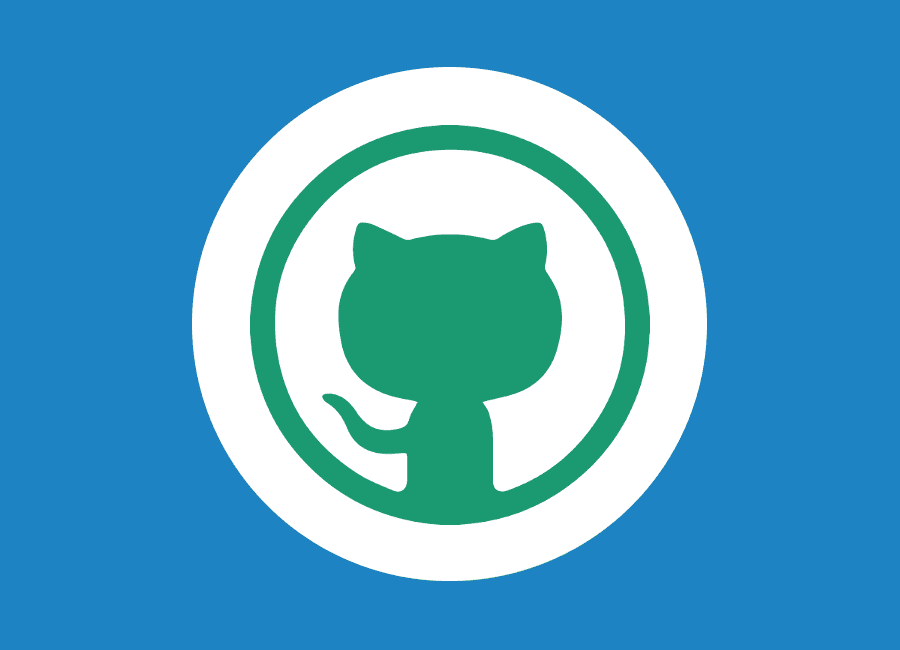

# Keynote Speakers
+ [Julia Hockenmaier](#julia_hockenmaier) (UIUC)
+ [Mirella Lapata](#mirella_lapata) (University of Edinburgh)
+ [Percy Liang](#percy_liang) (University of Edinburgh)
+
 

# Speaker Details

 [Julia Hockenmaier](http://juliahmr.cs.illinois.edu/) (UIUC)

**Talk**: _TBD_

**Bio**: TBD

 

 [Mirella Lapata](https://nlp4prog.github.io/2021) (University of Edinburgh)

**Talk**: _TBD_

**Bio**: TBD

 

 [Percy Liang](https://nlp4prog.github.io/2021) (Stanford; Microsoft Semantic
Machines)

**Talk**: _TBD_

**Bio**: TBD
 
